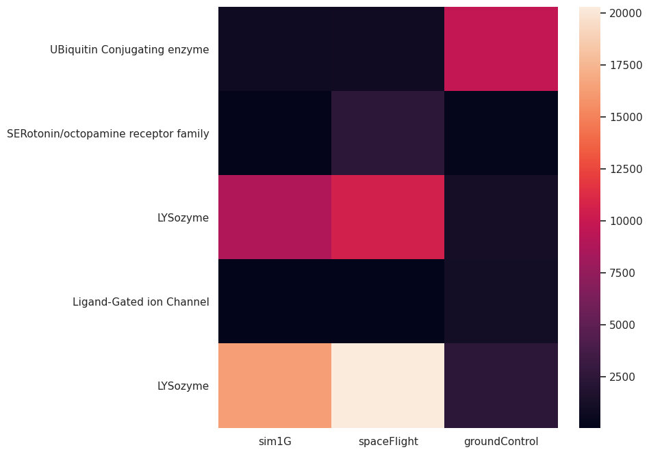

# Análisis transcriptómico del efecto de la microgravedad en C. elegans.

Diego Carmona Campos y Ethan Marcos Galindo Raya

## Introducción

La exploración espacial es una de las empresas más ambiciosas de la humanidad. Dentro de los objetivos a largo plazo de las misiones tripuladas está el generar el conocimiento suficiente para que el ser humano llegue a otros planetas, lo que requiere un acercamiento progresivo al espacio, como la misión Artemis de la NASA. Sin embargo, actualmente existen limitaciones que nos hacen ser modestos con nuestras expectativas para cumplir estos objetivos. Más allá de las dificultades tecnológicas, se han observado efectos negativos en la salud de los astronautas después de distintos periodos en el espacio. Entre ellos, se ha reportado atrofia muscular, reducción en la densidad ósea, cambio en el sistema cardiovascular, así como un debilitamiento del sistema inmunológico.

Para tener una comprensión sistemática de los mecanismos detrás de estos efectos es de gran importancia hacer análisis ómicos que nos permitan evaluar el estado fisiológico de las células expuestas a microgravedad. Por lo tanto, reutilizaremos datos de expresión disponibles en la base de datos de GEO para analizar los cambios a nivel transcriptómico que se presentan cuando las organismos están en vuelo espacial.

En particular, nos centraremos en el análisis de datos disponibles para el organismo modelo Caenorhabditis elegans, ya que es altamente relevante en el estudio de las neurociencias, el funcionamiento muscular así como la biología del desarrollo . Además, la presencia de genes ortólogos con seres humanos puede dar indicios de qué es lo que sucede realmente en los astronautas después de una misión espacial, impulsando el interés por conocer a detalle el transcriptoma de los gusanos espaciales.

## Método/Diseño/Análisis

### Colección de datos

Hicimos el script get_geo_ids.py para hacer una búsqueda en la base de datos de GEO utilizando el módulo Entrez de Bio-Python. En el script, usamos la función Entrez.esearch buscando Series de GEO asociadas con microgravedad o vuelo espacial usando el siguiente término:

“(((("microgravity" OR "Space flight") AND "{taxid}"[Organism]) AND "expression profiling by array"[DataSet Type]) AND "gse"[Entry Type])”

En donde {taxid} se reemplaza por el taxid del organismo de interés. En este caso, usamos el taxid 6239, que corresponde C Elegans.

python
# Desde data/QueryData/
# $bin es una variable que almacena el path hasta la carpeta bin
nohup python $bin/get_geo_ids.py -e diegocar@lcg.unam.mx \
-a 34677fdcfd2f0659a7f9ee05ab6e44704f09 -t 6239 -o cElegansSpaceGSEsIds.tsv \
-m 1000 -r 10 -f &

# El output se movió a cElegansSpaceGSEsIDs.out
mv nohup.out cElegansSpaceGSEsIDs.out

Usamos el script get_geo_metadata.py para descargar y parsear los archivos soft asociados a los GSEs que consultamos. Obtuvimos los metadatos asociados a esas entradas y descargamos las tablas de los GPLs correspondientes.

python
# Desde data/QueryData/
# $bin es una variable que almacena la ruta hasta la carpeta bin
# $PWD es una variable que almacena la ruta hasta el directorio actual
nohup python $bin/get_geo_metadata.py -i $PWD/cElegansSpaceGSEsIds.txt \
-o $PWD/cElegansGEOMetadata.tsv -g -r &

# El output se movió a cElegansGEOMetadata.out
mv nohup.out cElegansGEOMetadata.out

Usando el script get_supplementary_files.py filtramos los datos para quedarnos con los registros de Agilent con extensión .txt. Buscamos aquellos archivos que se obtuvieron con experimentos de un canal y los descargamos.

python
# Desde data/RawData
# $bin es una variable que almacena la ruta hasta la carpeta bin
# $query es una variable que almacena la ruta hasta la carpeta data/QueryData
# $PWD es una variable que almacena la ruta hasta el directorio actual
nohup python $bin/get_supplementary_files.py -i $query/cElegansGEOMetadata.tsv \
-m "Agilent Technologies" -f ".txt" -n 1 -o $PWD &

# Movimos el output a cElegansDownload.out
mv nohup.out cElegansDownload.out

El programa clasificó las entradas en 3 grupos con el siguiente número de registros:

- spaceFlight: Muestras tomadas en condiciones de microgravedad → 27 registros
- sim1G: Muestras a bordo de plataformas de vuelo espacial con gravedad simulada → 36 registros
- groundControl: Controles tomados en tierra → 9 registros

### Procesamiento de los datos

Con el scrip merge_data.py parseamos lo archivos suplementarios que descargamos. Los replicados de cada condición se condensaron en una sola columna usando el promedio de la expresión de cada gen. Luego se unieron las columnas correspondientes a cada condición en una sola matriz que se guardó en un archivo.

python
# Desde data/RawData
# $bin es una variable que almacena la ruta hasta la carpeta bin
# $PWD es una variable que almacena la ruta hasta el directorio actual
nohup python $bin/merge_data.py -i $PWD -o cElegansRawData.tsv &

# El output se movió a cElegansDownload.out
mv nohup.out cElegansMerging.out

Usamos la matriz generada por merge_data.py y aplicamos normalización por cuantiles. Este método tiene como objetivo hacer que todos los conjuntos de observaciones sigan una misma distribución para poder hacer comparaciones entre ellas.

python
# Desde data/NormData
# $bin es una variable que almacena la ruta hasta la carpeta bin
# $raw es una variable que almacena la ruta hasta data/RawData
# $PWD es una variable que almacena la ruta hasta el directorio actual
nohup python $bin/quantile_norm.py -i $raw/cElegansRawData.tsv -o cElegansNormData.tsv &

# Se movió el output a cElegansNormalization.out
mv nohup.out cElegansNormalization.out

### Análisis de Datos

Para comparar el perfil de expresión de C elegans en el espacio y en tierra, utilizamos los datos normalizados. Posteriormente filtramos los genes que estuvieran anotados según el GPL11346.txt. Para encontrar los genes diferencialmente expresados, calculamos la relación de expresión spaceFlight/groundControl y obtuvimos el logaritmo base 2 para encontrar cuántas veces se duplicaba la expresión. Usando un valor de corte 3 (los genes duplican su valor 3 veces en vuelo espacial) filtramos los resultados y los representamos en un heatmap.  

python
# Desde results/
# $bin es una variable que almacena la ruta hasta la carpeta bin
# $norm es una variable que almacena la ruta hasta data/NormData
# $PWD es una variable que almacena la ruta hasta el directorio actual
nohup python $bin/make_heatmap.py -i $norm/cElegansNormData.tsv -g $query/GPL11346.txt \
-a 3 -w 8 -e 8 -o $PWD/cElegansHeatMap.png

# Se movió el output
mv nohup.out cElegansHeatMap.out

## Pregunta/Hipótesis/Objetivo

Con este trabajo nos interesamos en conocer cuáles son los efectos de la microgravedad y el vuelo espacial en la expresión génica. 

Nosotros creemos que habrá una gran variedad de funciones afectadas por la microgravedad, en particular esperamos encontrar cambios en genes que regulen las dinámicas del citoesqueleto.

Con este trabajo pretendemos generar conocimiento acerca de los sistemas afectados por el vuelo espacial usando como modelo a C. elegans.

## Resultados

El heatmap generado por make_heatmap.py es:

Con este análisis encontramos que uno de los genes que cambiaron notablemente su expresión fue el de la lisozima. 

## Conclusión

La lisozima es una enzima importante en la respuesta antimicrobiana del organismo. Esto es interesante porque se ha observado que los astronautas tienen distintas afectaciones en el sistema inmunológico después de una misión en el espacio. Esto puede significar que tras condiciones de microgravedad, los organismos intentan compensar la inmunosupresión por medio de la expresión de lisozima para hacer una barrera que proteja al organismo contra agentes externos.

Con este trabajo demostramos que C elegans es un modelo interesante para estudiar los cambios en la expresión de los organismos en condiciones de microgravedad. En este caso, aunque esperábamos obtener información acerca de los circuitos regulatorios del citoesqueleto, terminamos encontrando a la lisozima como un gen importante en la respuesta a la microgravedad.

Por supuesto, los datos generados por medio de estos análisis necesitan de validación experimental para dar certeza de nuestros hallazgos, sin embargo, esperamos que al automatizar muchos pasos del análisis, la generación de hipótesis en este campo se vea enriquecida, con ello fortaleciendo la reutilización de la gran cantidad de datos disponibles en GEO.

## Referencias

Lisozima. (2023, August 25). Wikipedia, La Enciclopedia Libre.https://es.wikipedia.org/wiki/Lisozima

Quantile normalization. (2023, February 9). Wikipedia.[https://en.wikipedia.org/wiki/Quantile_normalization(https://en.wikipedia.org/wiki/Quantile_normalization)

[Lv Hongfang](https://royalsocietypublishing.org/author/Lv%2C+Hongfang), [Yang Huan](https://royalsocietypublishing.org/author/Yang%2C+Huan), [Jiang Chunmei](https://royalsocietypublishing.org/author/Jiang%2C+Chunmei), [Shi Junling](https://royalsocietypublishing.org/author/Shi%2C+Junling), [Chen Ren-an](https://royalsocietypublishing.org/author/Chen%2C+Ren-an), [Huang Qingsheng](https://royalsocietypublishing.org/author/Huang%2C+Qingsheng) and [Shao Dongyan](https://royalsocietypublishing.org/author/Shao%2C+Dongyan) 2023Microgravity and immune cells*J. R. Soc. Interface.**20*2022086920220869 [doi](https://doi.org/10.1098/rsif.2022.0869)
